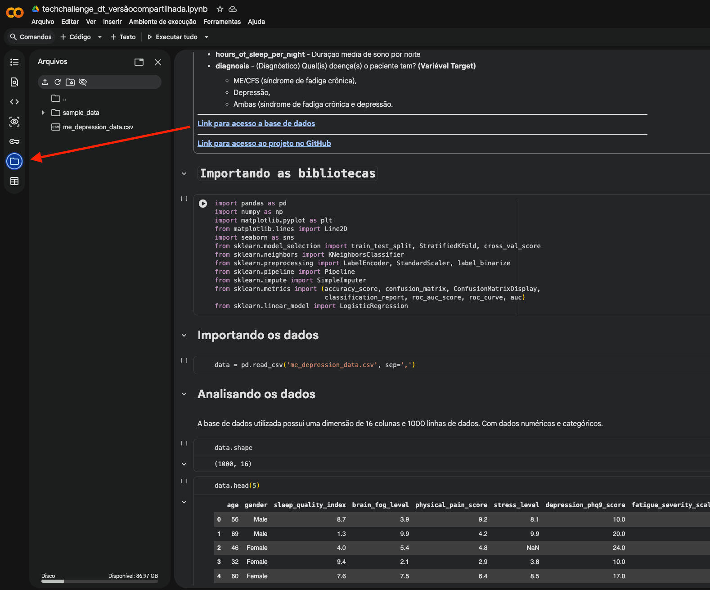
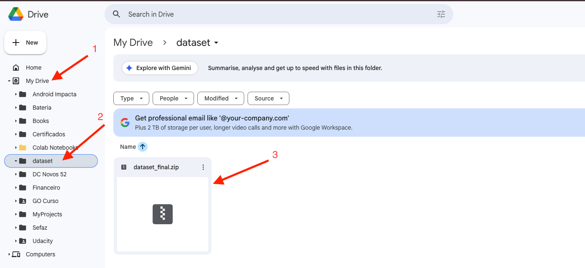

# Tech Challenge Fase 1

### Para Rodar o modelo Depressão / Fadiga

1. [Clique aqui para abrir o colab](https://colab.research.google.com/drive/1PcS7haXsHA50fObQhFU7PRIta1ifPxtk?usp=sharing#scrollTo=nkABRTYXsF1a) 
2. Adicione o arquivo me_depression_data.csv  o arquivo se encontra para download tanto no notebook conforme imagem como no [github](https://github.com/dtrusman/techchallenge-fase1)
3. Clique em executar tudo no colab

### Para Rodar o modelo Endometriose (Visão computacional)

1. [Clique aqui para abrir o colab](https://colab.research.google.com/drive/1ppymr7ZU2A1K_N7DMdckimO0L78g0xkv?usp=sharing)
2. Adicione no seu driver o arquivo dataset_final.zip 
Em My Drive, crie a pasta dataset e dentro dela coloque o arquivo dataset_final.zip
3. Clique em executar tudo no colab

### [Clique aqui para assistir o vídeo de apresentação](https://youtu.be/aIMuCPicCMQ)